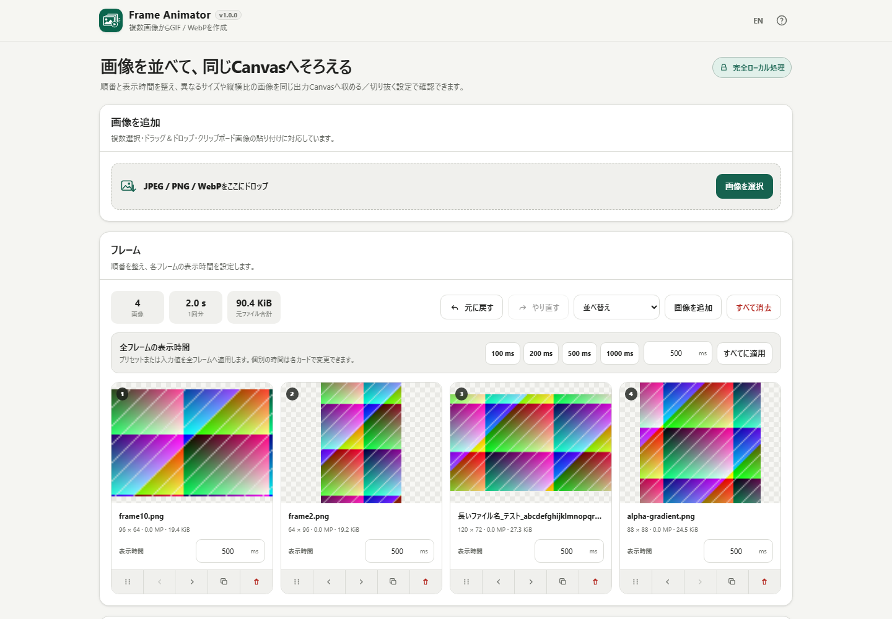

# Frame Animator

Frame Animatorは、複数のローカル画像からAnimated GIF / WebPを作るためのBrowser Kittyツールです。選択した画像を変換サーバーへアップロードせず、ブラウザ内で処理する構成を目指します。

> 現在の開発版は **v0.9.0 RC** です。v1.0.0に向けて新機能追加を止め、画像からGIF / WebPを作る一連の機能を回帰テストしています。

## 現在できること

- JPEG / PNG / 静止WebPを複数読み込み
- ファイル選択、Drag & Drop、既存一覧への追加
- サムネイル、ファイル名、画像サイズ、メガピクセル、元ファイル容量の確認
- Animated WebPを検出できる場合は静止画として扱わず明示的に拒否
- 最大200枚、1ファイル50 MiB、合計500 MiB、1画像50 MPの安全ガード
- 一部の画像だけ失敗した場合、正常画像を残したまま失敗理由を分離表示
- 全画像消去前の確認
- 専用ハンドルによるマウス / タッチのドラッグ並べ替え
- ドラッグを使わなくても操作できる前へ / 後ろへボタン
- フレームの複製・削除
- 読み込みや順序変更を対象にしたUndo / Redoとキーボードショートカット
- ファイル名の自然順による昇順 / 降順ソート
- 各フレーム20〜10,000 ms・10 ms刻み、初期500 msの表示時間
- 100 / 200 / 500 / 1000 msプリセットまたは自由入力を全フレームへ一括適用
- 現在のフレーム列から合計再生時間を表示
- 実際の各フレーム表示時間で動くライブプレビュー
- 再生 / 一時停止、最初から、前のフレーム、次のフレーム
- 表示時間変更もUndo / Redo対象
- サイズ・縦横比が異なる画像を1つの出力Canvasへ統一
- 自動 / 長辺480 / 720 / 1080px / 元サイズ相当 / カスタム
- 画像全体を見せる「収める」とCanvasを埋める「切り抜く」
- 透明 / 白 / 黒 / カスタム色の背景
- 透明部分をチェッカーボードで確認
- プレビュー画像は必要なフレームだけ都度デコードして解放し、全フレームのフルRGBAを保持しない
- GIF89aをブラウザ内で生成する内蔵エンコーダ
- 64 / 128 / 256色のGIF出力
- 写真やグラデーションの階調を補うFloyd–Steinberg Dithering（初期ON）
- 無限ループ / 1回だけ
- 各フレームの表示時間をGIFへ反映
- 元画像を1枚ずつフル解像度で正規化し、RGBAをWorkerへTransfer
- 色量子化・Dithering・LZW圧縮をBlob Workerで処理
- 進捗表示とキャンセル
- 実際に生成したGIFを保存前に再生確認
- Canvas・フレーム数・再生時間・ファイル容量の表示
- 編集可能なファイル名と安全な`.gif`保存
- 出力へ影響する設定変更後は古いGIF結果を無効化
- 固定した @jsquash/webp 1.5.0 / libwebp WASMによるAnimated WebP出力
- WebP品質1〜100、Lossless、Effort 0〜6
- 各フレームのミリ秒単位の表示時間をAnimated WebPへ保持
- WebPの無限ループ / 1回だけ
- 実際に生成したWebPを保存前に確認
- プレビュー・GIF・WebP共通のForward / Reverse / Ping-pong再生順
- 端点を重複させないPing-pongシーケンス
- 無限 / 1回 / 2〜100回の共通ループ設定
- JPEG / PNG / 静止WebPのクリップボード貼り付け
- Canvasサイズと派生フレーム数に基づく高負荷処理の事前警告
- `.gif` / `.webp`の固定サフィックスと誤入力拡張子の自動整理
- 最初は大きく、画像読み込み後はコンパクトになる画像追加欄（クリック追加・Drag & Dropは継続利用可能）
- ユーザー指定SVGをアプリアイコンとfaviconの両方に使用
- 640px以下では「フレーム / プレビュー / 書き出し」の段階表示
- safe area対応とスマホ主要操作44px以上のタップ領域
- 320 / 360 / 390pxを意識した狭幅レイアウト。360px以下では書き出し設定を1列化
- 大量フレーム向けのサムネイル遅延デコードと一時Canvasの早期解放
- 1フレームの表示時間変更では全フレームカードを作り直さない再描画最適化
- `aria-posinset` / `aria-setsize`によるフレーム位置情報
- ページが非表示になったときのプレビュー自動停止
- GIF / WebP生成失敗後も画像や設定を維持し、リロードせず設定変更・再試行できるエラー状態
- 日本語 / 英語を同じHTMLに内包し、言語切替はEN / JAの短い表示
- PC / スマートフォン対応のレスポンシブUI
- 実行時CDN、Analytics、Telemetry、外部APIなし

## 操作フロー

現在のRCでは次の流れを一通り利用できます。

1. 画像を追加
2. フレームを並べ替え
3. 全体または各フレームの表示時間を設定
4. 出力サイズとFit / Fillを設定
5. Forward / Reverse / Ping-pongをプレビュー
6. Animated WebPまたはGIFを作成
7. 実際に生成されたファイルを確認して保存

段階的な実装内容は [DEVELOPMENT_PLAN.md](DEVELOPMENT_PLAN.md) を参照してください。

## スクリーンショット

### PC



### スマートフォン


## プライバシー

読み込んだ画像はブラウザ内に留まります。Frame Animatorは選択ファイルをアップロードせず、変換用バックエンドも使用しません。

CSPは `connect-src 'none'` を使用し、Analytics、Telemetry、実行時CDN、外部フォント、外部APIを利用しません。

読み込んだ画像そのものをlocalStorageやIndexedDBへ自動保存しません。ページを閉じると作業中の画像セットは破棄されます。

## v0.9.0の対応入力

対応:

- JPEG / JPG
- PNG
- 静止WebP

未対応:

- Animated WebP
- GIF
- APNG
- 動画
- HEIC / HEIF
- AVIF
- SVG
- PSD
- PDF

## v0.9.0の上限

- 最大200枚
- 1ファイル50 MiB
- 読み込み済み元ファイル合計500 MiB
- 1画像50メガピクセル
- 1フレーム20〜10,000 ms、10 ms刻み
- 出力Canvasの幅・高さ16〜4096px

これらはアプリ側の安全ガードであり、すべてのブラウザや端末の絶対的な上限を示すものではありません。

## ブラウザ

主対象は現行Chrome / Edgeです。Firefox、Safari、iOS Safari、Android Chromeも開発中に確認対象とします。

最終的な単一HTML版は `file://` で直接開いて主要機能を利用できることを要件とします。

## 単一HTMLビルド

このリポジトリは現在のBrowser Kitty `htmlapps-template` のビルド契約に従います。

Windows PowerShell:

```powershell
./build-standalone.ps1
```

通常ビルドでは、読みやすい単一HTML、gzip自己展開版、テンプレート規約に従ったリポジトリ直下の配布用HTMLを生成します。

完了前には以下を実行します。

```powershell
powershell.exe -NoLogo -NoProfile -ExecutionPolicy Bypass -File .\scripts\check-powershell-syntax.ps1
powershell.exe -NoLogo -NoProfile -ExecutionPolicy Bypass -File .\scripts\check-repository.ps1
```

## 開発

製品仕様と受入条件は [APP_SPEC.md](APP_SPEC.md)、段階的な開発計画は [DEVELOPMENT_PLAN.md](DEVELOPMENT_PLAN.md) を正とします。

## ライセンス

MIT。詳細は [LICENSE](LICENSE) を参照してください。

第三者ライブラリの情報は [THIRD_PARTY_NOTICES.md](THIRD_PARTY_NOTICES.md) に記載します。v0.9.0では、ローカルWebP生成のため固定した `@jsquash/webp@1.5.0` とlibwebpエンコーダ資産を単一HTMLへ内包します。
