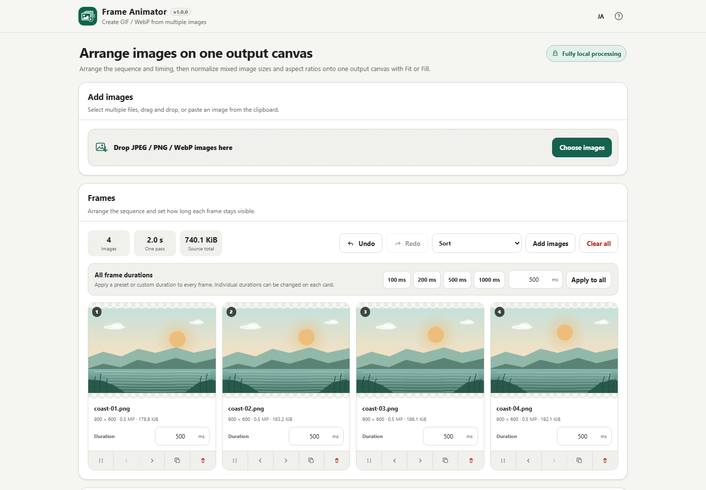
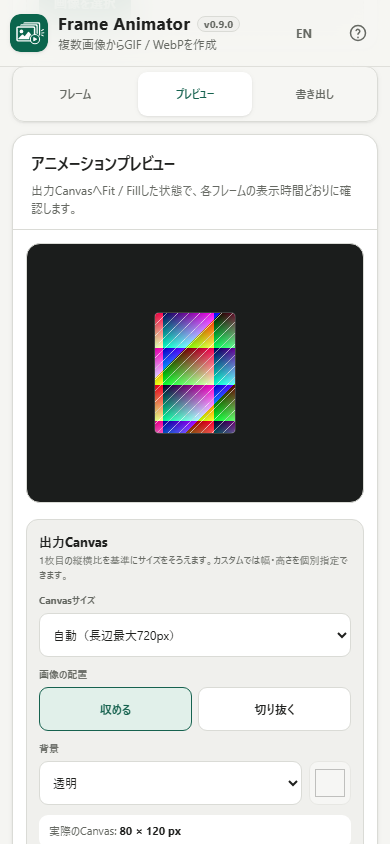

# Frame Animator

Frame Animator is a Browser Kitty utility for turning multiple local still images into an animated GIF or WebP without uploading the source images.

> Current development version: **v0.9.0 RC**. Feature work is frozen while the complete image-to-GIF/WebP workflow is being regression-tested for v1.0.0.

## Current features

- Import multiple JPEG, PNG, and still WebP images
- File selection, Drag & Drop, and adding more images to the current session
- Thumbnail list with filename, dimensions, megapixels, and source size
- Reject detectable Animated WebP instead of silently treating it as one still frame
- Safety guards: 200 frames, 50 MiB per file, 500 MiB source total, 50 MP per image
- Partial failure reporting: valid images remain usable when another image fails
- Explicit confirmation before clearing all imported images
- Reorder frames by mouse/touch drag from a dedicated handle
- Earlier/later buttons as a non-drag reordering path
- Duplicate and delete individual frames
- Undo / Redo for imports and sequence edits, including keyboard shortcuts
- Natural filename sorting in ascending or descending order
- Per-frame duration from 20–10,000 ms in 10 ms steps, defaulting to 500 ms
- Apply 100 / 200 / 500 / 1000 ms presets or a custom duration to every frame
- Total animation duration based on the current sequence
- Live variable-duration preview with Play / Pause, Restart, Previous, and Next
- Timing edits participate in Undo / Redo and resume playback when edited during playback
- Normalize mixed source sizes onto one output canvas
- Auto / 480 / 720 / 1080 / original-equivalent / custom canvas sizing
- Fit or Fill placement with centered geometry
- Transparent / white / black / custom-color backgrounds
- Checkerboard transparency preview
- On-demand preview decode with ImageBitmap cleanup; no full-sequence RGBA retention
- Local GIF89a encoder running color reduction, dithering, and LZW compression in a Blob Worker
- 64 / 128 / 256-color GIF output
- Floyd–Steinberg dithering, enabled by default for smoother photographic gradients
- Infinite-loop or play-once GIF output
- GIF timing from the current per-frame durations
- Full-resolution source frames normalized one at a time and transferred to the Worker
- Encoding progress and cancellation
- Actual generated GIF preview with dimensions, frame count, duration, and file size
- Editable/sanitized output filename and local GIF download
- Stale-result invalidation when an output-affecting setting changes
- Animated WebP export using pinned @jsquash/webp 1.5.0 / libwebp WASM
- Quality 1–100, Lossless, and Effort 0–6 controls
- Variable per-frame millisecond timing preserved in the Animated WebP container
- Infinite-loop and play-once Animated WebP
- Actual generated WebP preview and local save
- Shared Forward / Reverse / Ping-pong playback order for preview, GIF, and WebP
- Ping-pong sequence without duplicate endpoints
- Infinite / once / custom 2–100 play-count setting shared by both export formats
- Clipboard image paste for JPEG / PNG / still WebP
- High-load export warning based on resolved canvas size and derived frame count
- Format-aware filename handling: visible .gif / .webp suffix plus extension sanitization
- Large initial image drop zone that becomes compact after images are loaded while remaining clickable and droppable
- User-supplied Frame Animator SVG used for both the app icon and favicon
- Smartphone-only Frames / Preview / Export staged navigation at 640 px and below
- Safe-area-aware mobile layout and 44 px touch targets
- 320 / 360 / 390 px responsive hardening, including single-column export options at narrow width
- Lazy thumbnail decoding and prompt temporary-canvas release for large frame lists
- Single-frame timing edits avoid rebuilding the entire frame-card DOM
- Frame position semantics with `aria-posinset` / `aria-setsize`
- Preview automatically pauses when the document becomes hidden
- Recoverable GIF/WebP failure states that keep project data intact and allow retry without reload
- Japanese and English in the same HTML; the language switch uses compact EN / JA labels
- Responsive desktop and smartphone layout
- No runtime CDN, analytics, telemetry, or external API

## Workflow

The current RC supports this complete flow:

1. Add images.
2. Reorder frames.
3. Set global or per-frame timing.
4. Choose output size and Fit / Fill.
5. Preview Forward / Reverse / Ping-pong motion.
6. Create Animated WebP or GIF.
7. Review the generated file and save it.

See [DEVELOPMENT_PLAN.md](DEVELOPMENT_PLAN.md) for the milestone breakdown.

## Screenshots

### Desktop



### Mobile



## Privacy

Imported images stay in the browser. Frame Animator does not upload selected files or use an application backend for conversion.

The app uses a restrictive Content Security Policy with `connect-src 'none'`. It has no analytics, telemetry, runtime CDN, external font, or external API.

Imported image bytes are not automatically persisted to localStorage or IndexedDB. Closing the page discards the working image set.

## Input support in v0.9.0

Supported:

- JPEG / JPG
- PNG
- still WebP

Not supported yet:

- Animated WebP
- GIF
- APNG
- video
- HEIC / HEIF
- AVIF
- SVG
- PSD
- PDF

## Limits in v0.9.0

- 200 images
- 50 MiB per source file
- 500 MiB total imported source bytes
- 50 megapixels per source image
- 20–10,000 ms per frame in 10 ms steps
- output canvas width/height: 16–4096 px

These are application safety guards and do not describe the absolute limits of every browser or device.

## Browser support

The primary targets are current Chrome and Edge. Firefox, Safari, iOS Safari, and Android Chrome are also considered during development.

The final standalone build is required to work when opened directly with `file://`.

## Single-HTML build

The repository follows the current Browser Kitty `htmlapps-template` contract.

On Windows PowerShell:

```powershell
./build-standalone.ps1
```

The build produces the readable standalone HTML, a gzip self-extracting variant, and the repository-root readable copy defined by the template.

Before completion, run:

```powershell
powershell.exe -NoLogo -NoProfile -ExecutionPolicy Bypass -File .\scripts\check-powershell-syntax.ps1
powershell.exe -NoLogo -NoProfile -ExecutionPolicy Bypass -File .\scripts\check-repository.ps1
```

## Development

Product behavior and acceptance criteria live in [APP_SPEC.md](APP_SPEC.md). The staged roadmap is in [DEVELOPMENT_PLAN.md](DEVELOPMENT_PLAN.md).

## License

MIT. See [LICENSE](LICENSE).

Third-party notices are recorded in [THIRD_PARTY_NOTICES.md](THIRD_PARTY_NOTICES.md). v0.9.0 embeds pinned `@jsquash/webp@1.5.0` and its libwebp encoder assets for local WebP generation.
